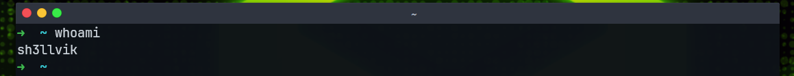
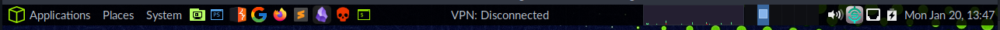

```bash
     ▄▄▄▀▄▄▄
▄▄▀▀▀       ▀▀▄▄▄
█▀▀▄▄         ▄▄▀▀█    █  █         ▐▌     ▄█▄ █          ▄▄▄▄
█    ▀▀▀▄▄▄▀▀▀    █    █▄▄█ ▀▀█ █▀▀ ▐▌▄▀    █  █▀█ █▀█    █▌▄█ ▄▀▀▄ ▀▄▀
█        █        █    █  █ █▄█ █▄▄ ▐█▀▄    █  █ █ █▄▄    █▌▄█ ▀▄▄▀ █▀█
█        █        █
█        █        █    P  E  N   -   T  E  S  T  I  N  G     L  A  B  S
▀▀▄▄     █     ▄▄▀▀
    ▀▀▀▄▄█▄▄▀▀▀

```


---

## Clone the repo

```bash
git clone https://github.com/shellvik/shvbox
```

- Download the repo

```bash
wget -c https://github.com/shellvik/hbox/archive/master.zip -O shvbox.zip  && unzip shvbox.zip && rm -rf shvbox.zip
```

## Install

### Install Mate Desktop Environment

- This will install complete MATE desktop(Required in Kali, Parros HTB edition has MATE by default).

```bash
sudo apt-get install mate-desktop-environment mate-tweak dconf-editor
```

- Or install the base packages required for a minimal MATE desktop: `mate-desktop-environment-core`.
- Or install the complete MATE desktop including a few extras: `mate-desktop-environment-extras`

### Run Install Script

```bash
cd shvbox
sudo chmod +x install.sh
./install.sh
```

## Visual Changes

### Selecting Theme

- Change the DE to MATE.
- Go to `Appearence Preferences` : In the top bar, click on : `System` >> `Preferences` >> `Look and Feel` >> `Appearance`.
- Change the theme : `Appearence Preferences` >> `Theme` >> `HackTheBox`.

### Setting Fonts

- Go to `Appearence Preferences` >> `Fonts`:


## Customizing Terminal

- **Terminal Emulator** : _Kitty_/_Ghostty_, _Terminator_.
- **Bash Prompt** : HTB Pwnbox for Terminator
  
- **Zsh Prompt** : Default OMZ prompt for Kitty/Ghostty
  
- Installation :

```bash
sh -c "$(curl -fsSL https://raw.githubusercontent.com/ohmyzsh/ohmyzsh/master/tools/install.sh)"
```

## Keep OpenVPN at right place

- Keep academy and lab vpn in : `/etc/htb-vpn-config/` as `aca-htb.ovpn`
  and `lab-htb.ovpn`.
- **Connecting to vpn**:

```bash
shvpn {aca|lab}
```

---

## Customizing Panel



### VPN Panel Setup

- `Right-click on the top panel` > `Add to Panel` > `Find an item to add to the panel` > `Type Command` > `Double-click the Command item`.

- `Right-click on the clock` > `Preferences` > `Replace "date +%T" with "/etc/htb-vpn-config/vpnpanel.sh"`.

### Top Palnel Tool Bar Setup

#### Add application launcher to panel :

- `Right-click an empty space on the panel` > `Add to Panel` > `Application Launcher`.

#### Change the application icons :

- `Right-click on the app launcher on the panel` > `Properties` > `Icon` > `Select icon from /usr/share/icons/htb-icons`.

### System Monitor and Workspace

- Configure the System Monitor:
  - Right-click the **System Monitor** (the 3 boxes showing system usage) > `Preferences`.
  - Uncheck everything under **Monitored Resources** except **Processor**.
  - Set:
    - **System Monitor Width** to `135`.
    - **System Monitor Update Interval** to `100`.
  - Close the Preferences window.
- Add Workpace - Number 6
